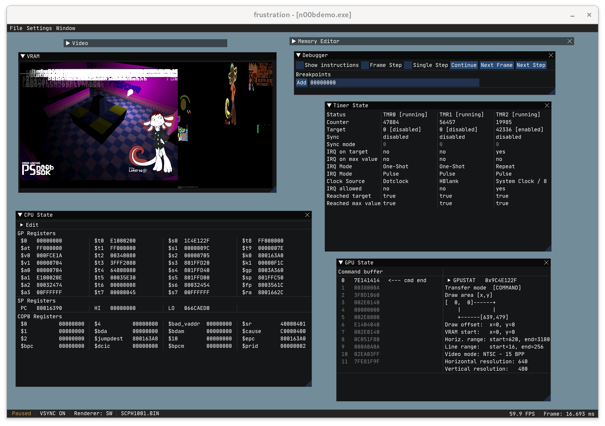

<div align="center">

# FruStration
*An experimental PSX/PS1 emulator for Linux written in C++*


</div>

<p align="center">
  
</p>

## Usage

Compiled binaries of the latest master commit can be downloaded from the _Release_ section. SDL2 needs to be installed on the system. A reasonably modern version of OpenGL is required for the hardware renderer.

To run the emulator, a valid PS1 BIOS file needs to be provided (e.g. SCPH1001). Use the `--bios` argument to point to the BIOS file.

### Example

```shell
./frustration --bios SCPH1001.BIN
```

The emulator will save the BIOS file location and other settings in a config file called `frustration.ini`.

Game ISOs and PS-EXE files can be launched by **dragging them into the emulator window** or by using the corresponding command line arguments. Use `--help` to see all available options.

If no executable files are provided the emulator will launch the PS1 main menu.

### Debugger

FruStration includes a custom ImGUI-based debugger with a MIPS disassembler, _single instruction_ and _single frame_ stepping and support for breakpoints and watchpoints.

Additionally, a built-in GDB server can be used to connect the emulator to a GDB client. The default port is `45678` and can be changed in the config file.

### Keybindings

- **H**: Pause or resume emulator execution (the emulator starts paused)
- **R**: Reset the emulator

### Default Controller Keybindings (Digital Pad)

- **Start**: Enter
- **Select**: Space
- **Direction Keys**: Up, Down, Left, Right
- **W**: Triangle
- **A**: Square
- **S**: X
- **D**: Circle
- **Q**: L1
- **E**: R1
- **Z**: L2
- **C**: R2

#### Debugger Keybindings

- **F5**: Continue
- **F6**: Single Step Instruction
- **F7**: Single Step Frame

## Building

Requirements (Debian/Ubuntu package names):
* CMake (`cmake`)
* pkgconfig (`pkg-config`)
* SDL2 (`libsdl2-dev`)
* Optional for native file picker: GTK3 (`libgtk-3-dev`)

1. Clone the repository: `https://github.com/misztak/FruStration.git`
2. Run the following cmake commands inside the FruStration folder:

```shell
cmake -S . -B build -DCMAKE_BUILD_TYPE=Release
cmake --build build -j $(nproc)
```

If you want to build the emulator without the GTK dependency disable the native file picker with `-DUSE_NATIVE_FILE_PICKER=OFF`.

## Disclaimer

"PlayStation" and "PSX" are registered trademarks of Sony Interactive Entertainment Europe Limited. This project is not affiliated in any way with Sony Interactive Entertainment.
